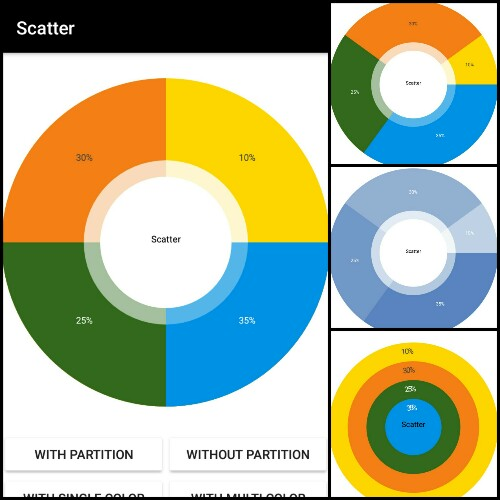

# Scatter (PieChart)
Easy and simple implementation of PieChart with Scatter

### Specs
[](https://jitpack.io/#IntruderShanky/scatter-piechart)
[](http://android-arsenal.com/details/1/4492)
[](https://android-arsenal.com/api?level=11)

<a href='http://www.youtube.com/watch?v=qqUe7pjnHyw'></a>

[Demo App - IS Library](https://play.google.com/store/apps/details?id=com.intrusoft.islibrarydemo)

<a href='https://play.google.com/store/apps/details?id=com.intrusoft.islibrarydemo&utm_source=global_co&utm_small=prtnr&utm_content=Mar2515&utm_campaign=PartBadge&pcampaignid=MKT-Other-global-all-co-prtnr-py-PartBadge-Mar2515-1'></a>


### Graphic


###Usage
Step 1. Add the JitPack repository to your build file
```groovy
allprojects {
  repositories {
    ...
    maven { url "https://jitpack.io" }
  }
}
```
Step 2. Add the dependency
```groovy
dependencies {
  compile 'com.github.IntruderShanky:scatter-piechart:1.0.0'
}
```
### Implementation
###### Simple Chart
```xml
<com.intrusoft.scatter.SimpleChart
        android:id="@+id/simple_chart"
        android:layout_width="match_parent"
        android:layout_height="match_parent"
        scatter:aboutChart="About Your Chart"
        scatter:aboutTextColor="@color/aboutTextColor"
        scatter:centerColor="@color/centreColor"
        scatter:chartColor="@color/chartBackgroundColor"
        scatter:equalPartition="false"
        scatter:textColor="@color/textColor" />
```

###### Pie Chart
```xml
<com.intrusoft.scatter.PieChart
        android:id="@+id/pie_chart"
        android:layout_width="match_parent"
        android:layout_height="match_parent"
        scatter:aboutChart="About Your Chart"
        scatter:aboutTextColor="@color/aboutTextColor"
        scatter:centerColor="@color/centreColor"
        scatter:chartColor="@color/chartBackgroundColor"
        scatter:equalPartition="false"
        scatter:textColor="@color/textColor" />
```

Add ChartData to the Charts

```java
PieChart pieChart = (PieChart) findViewById(R.id.pie_chart);
List<ChartData> data = new ArrayList<>();
data.add(new ChartData("First", 35));     //ARGS-> (display text, percentage)
data.add(new ChartData("Second", 25));
data.add(new ChartData("Third", 30));
data.add(new ChartData("Fourth", 10));
pieChart.setChartData(data);

//chart data with specified colors
SimpleChart simpleChart = (SimpleChart) findViewById(R.id.simple_chart);
data = new ArrayList<>();

//ARGS-> (displayText, percentage, textColor, backgroundColor)
data.add(new ChartData("First", 35, Color.WHITE, Color.parseColor("#0091EA")));
data.add(new ChartData("Second", 25, Color.WHITE, Color.parseColor("#33691E")));
data.add(new ChartData("Third", 30, Color.DKGRAY, Color.parseColor("#F57F17")));
data.add(new ChartData("Fourth", 10, Color.DKGRAY, Color.parseColor("#FFD600")));
simpleChart.setChartData(data);
```

### XML Attributes
```xml
<!-- About The Chart will display on the center of chart -->
scatter:aboutChart="Scatter"

<!-- TextColor of About -->
scatter:aboutTextColor="@color/colorPrimary"

<!-- TextSize of About -->
scatter:aboutTextSize="25"

<!-- Color of center circle (Not valid in SimpleChart) -->
scatter:centerColor="@color/colorAccent"

<!-- This color will be used when chart data will not provide background color -->
scatter:chartColor="#0D47A1"

<!-- The chart partition should be equal or not -->
scatter:equalPartition="false"

<!-- TextSize of displayText -->
scatter:textSize="28"

<!-- TextColor of diaplayText -->
scatter:textColor="@color/colorAccent"
```

Licence
--------

```
Licensed under the Apache License, Version 2.0 (the "License");
you may not use this file except in compliance with the License.
You may obtain a copy of the License at

    http://www.apache.org/licenses/LICENSE-2.0

Unless required by applicable law or agreed to in writing, software
distributed under the License is distributed on an "AS IS" BASIS,
WITHOUT WARRANTIES OR CONDITIONS OF ANY KIND, either express or implied.
See the License for the specific language governing permissions and
limitations under the License.
```

